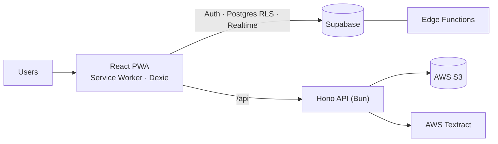

<div align="center">

# 🌍 Overseas ERP

**A multi-tenant, offline-first ERP for overseas recruitment agencies.**
Manage candidates from first registration to flight departure, in one workflow, on any device.

[Live App](https://www.reaz.shop) · [Architecture](docs/architecture/ARCHITECTURE.md) · [Development Guide](docs/guides/DEVELOPMENT.md)


</div>

---

## Overview

Overseas ERP replaces spreadsheets and paper files for agencies that send workers abroad. Every candidate moves through a defined pipeline (**Medical → MOFA → Finger → Police Clearance → Takamul → Visa → BMET → Flight**) and the system tracks each stage, document, payment and deadline along the way.

It is built as an installable **Progressive Web App**, so staff get a fast, app-like experience on desktop and mobile, even on unreliable connections.

## Features

**Recruitment workflow**
- Candidate management with a central **stage engine** that drives status across all modules
- Dedicated modules for Medical, MOFA, Finger, Police Clearance, Takamul (trade test), Visa, BMET and Flight
- Agents and Agencies with their own profiles and candidate history
- Candidate profile with processing stepper, timeline and QR card

**Finance and reporting**
- Accounts: sales, transactions, payroll, fixed costs, invoices, parties, receivables, payables and assets
- Invoice and report generation as PDF
- Reusable document templates
- Dashboard with live stats and charts

**Platform**
- 🏢 **Multi-tenant** by design, with tenant isolation enforced through Postgres Row Level Security
- 🔐 Role-based access control and invitation-based onboarding
- 📴 **Offline-first PWA**: cached app shell, local IndexedDB data and background sync
- ⚡ Realtime notifications and live data updates
- 🔎 Global search (`Ctrl + K`)
- 🪪 Passport OCR through AWS Textract
- 📦 Workspace data export / import and backups
- 🌗 Light and dark theme

## Tech Stack

| Layer | Technology |
| --- | --- |
| Frontend | React 19, TypeScript, Vite, React Router |
| UI | Tailwind CSS 4, shadcn/ui, Radix UI, Motion, Recharts |
| State and data | TanStack Query, Zustand, Dexie (IndexedDB) |
| PWA | `vite-plugin-pwa` (Workbox) |
| Backend | Supabase (Auth, Postgres + RLS, Realtime, Edge Functions) |
| API | Hono on Bun |
| Cloud (optional) | AWS S3, Textract, Lambda, provisioned with Terraform |
| PDF | `@react-pdf/renderer` |
| Tooling | Bun, ESLint, Prettier, GitHub Actions, Docker |

## Architecture



**Core principle:** the core ERP never hard-depends on AWS. Candidates, workflow, finance and reports keep working if AWS is unavailable. Only AWS-backed features (document upload and OCR) are affected.

For the full design, see [`docs/architecture/ARCHITECTURE.md`](docs/architecture/ARCHITECTURE.md).

## Project Structure

```text
.
├── src/
│   ├── app/            # App entry, router, providers
│   ├── components/     # ui/ (shadcn) and shared/ (toast, pwa, sync status)
│   ├── hooks/          # Reusable React hooks
│   ├── lib/            # Supabase client, query client, local DB (Dexie)
│   ├── store/          # Global UI state
│   └── modules/
│       ├── auth/       # Login, signup, invitations
│       ├── landing/    # Public pages
│       └── erp/        # Feature modules (candidates, visa, accounts, ...)
├── server/             # Hono API (Bun)
├── supabase/           # SQL migrations and Edge Functions
├── aws/                # OCR Lambda
├── infra/terraform/    # Infrastructure as code
├── docs/               # Architecture, DevOps and development guides
├── tests/              # Unit tests
└── public/             # PWA icons and static assets
```

## Getting Started

### Prerequisites

- [Bun](https://bun.sh) `>= 1.3`
- A [Supabase](https://supabase.com) project
- (Optional) AWS account for OCR and file storage

### 1. Clone and install

```bash
git clone <your-repo-url>
cd OverseasErp

bun install
cd server && bun install && cd ..
```

### 2. Configure environment

Create `.env` in the project root:

```env
VITE_SUPABASE_URL=https://<project-ref>.supabase.co
VITE_SUPABASE_PUBLISHABLE_KEY=<your-publishable-key>
```

Create `server/.env` (see [`server/.env.example`](server/.env.example)):

```env
PORT=8000
SUPABASE_URL=https://<project-ref>.supabase.co
SUPABASE_SERVICE_ROLE_KEY=<service-role-key>
```

> ⚠️ The service role key bypasses RLS. Keep it on the server only and never expose it to the frontend.

### 3. Set up the database

```bash
bunx supabase link --project-ref <project-ref>
bunx supabase db push                 # apply migrations
bunx supabase functions deploy        # deploy Edge Functions
```

### 4. Run

```bash
# Terminal 1: frontend (proxies /api to localhost:8000)
bun run dev

# Terminal 2: API
cd server && bun run dev
```

The app runs at `http://localhost:5173` and the API at `http://localhost:8000`.

## Scripts

| Command | Description |
| --- | --- |
| `bun run dev` | Start the Vite dev server |
| `bun run build` | Type-check and create a production build |
| `bun run preview` | Preview the production build locally |
| `bun run typecheck` | Run the TypeScript compiler without emitting |
| `bun run lint` | Lint with ESLint |
| `bun run format` | Format with Prettier |
| `bun test` | Run unit tests |

## Progressive Web App

The app is installable and designed to open instantly, with or without a network:

```text
Open app
  → Service Worker serves the cached app shell
  → UI renders immediately from local IndexedDB (Dexie)
  → Supabase syncs in the background
  → Only changed records update on screen
```

- All app files are precached, so every route works offline.
- New versions download in the background. Users are notified, and the update is applied on tap or when they leave the app.
- Offline writes are queued locally and pushed when the connection returns.

## Deployment

**Vercel** is the primary target. `vercel.json` configures SPA routing. Set the `VITE_*` variables in the project settings.

**Docker** (nginx serving the static build):

```bash
docker build --build-arg COMMIT_SHA=$(git rev-parse --short HEAD) -t overseas-erp .
docker run -p 8080:80 overseas-erp
```

**Infrastructure** for AWS services lives in [`infra/terraform`](infra/terraform). See [`docs/devops`](docs/devops) for the CI/CD and security plan.

## CI/CD

GitHub Actions run on every push and pull request:

| Workflow | Purpose |
| --- | --- |
| `ci.yml` | Test, type-check, lint and build |
| `pr-checks.yml` | Pull request validation |
| `dependency-check.yml` | Dependency audit |
| `vercel-check.yml` | Deployment check |
| `cd.yml` / `release.yml` | Deployment and tagged releases |

## Roadmap

| Priority | Task | Why |
| :---: | --- | --- |
| 🔴 | **Stage service** | Becomes the brain of the whole ERP workflow |
| 🔴 | **Requested services (JSONB)** | Defines which services each candidate takes |
| 🔴 | **Automatic stage transitions** | Reduces manual stage updates from modules |
| 🔴 | **Status consistency** | Keeps stage correct when Visa, Flight or Medical completes |
| 🟠 | **Full RLS audit** | Confirms every table follows tenant isolation |
| 🟠 | **Tenant-wise SL standardization** | Fixes race conditions in serial numbering |
| 🟠 | **Query optimization** | Avoids bottlenecks as data grows |
| 🟡 | **Error handling standardization** | One error contract across all services |
| 🟡 | **Audit and history** | Who changed what, and when |
| 🟡 | **MVP testing checklist** | End-to-end CRUD, RLS and workflow tests |

## Documentation

| Document | Description |
| --- | --- |
| [Architecture](docs/architecture/ARCHITECTURE.md) | Multi-server design and core principles |
| [Scalable Architecture](docs/architecture/sre.md) | Scaling plan for infrastructure |
| [RBAC](docs/architecture/rbac.md) | Roles and permissions |
| [Development Guide](docs/guides/DEVELOPMENT.md) | Workflow, releases and commit rules |
| [Git Workflow](docs/guides/GIT_WORKFLOW.md) | Branching and pull requests |
| [CI/CD and Security](docs/devops/OverseasErp-CI-CD-Security-BPR.md) | Pipeline and security practices |

## Contributing

1. Branch from `develop`: `feature/<name>`, `bugfix/<name>` or `refactor/<name>`
2. Follow [Conventional Commits](https://www.conventionalcommits.org): `feat(candidates): add passport preview`
3. Make sure `bun run typecheck`, `bun run lint` and `bun test` pass
4. Open a pull request using the template and link the issue (`Closes #123`)

See [`docs/guides/GIT_WORKFLOW.md`](docs/guides/GIT_WORKFLOW.md) for details.

## Security

- Tenant isolation is enforced at the database level with Row Level Security
- Secrets are never committed. Use environment variables
- To report a vulnerability, contact the maintainers privately instead of opening a public issue

## License

Copyright © Overseas ERP. All rights reserved.
